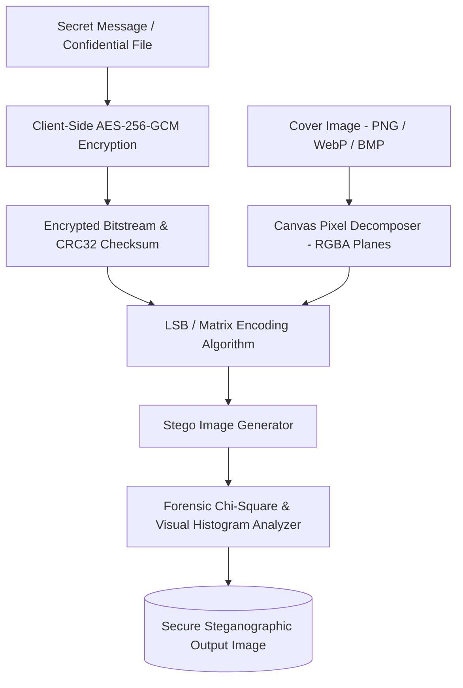

# 🕵️‍♂️ Harry StegoCrypt: Cyber Forensic & Cryptographic Steganography Suite
> **Next-generation browser-based steganography engine and digital forensic suite for pixel-level payload embedding, high-entropy anomaly detection, and AES-256 payload encryption.**

[](https://opensource.org/licenses/MIT)
[](https://www.typescriptlang.org/)
[](https://reactjs.org/)
[](https://vitejs.dev/)
[]()

---

## 🏛️ Architecture Overview

Harry StegoCrypt provides zero-server-leakage client-side steganographic hiding and forensic steganalysis using WebAssembly, Web Workers, and WebCrypto APIs.



---

## 🚀 Key Capabilities

* **Multi-Layer Steganography:** Least Significant Bit (LSB 1-bit, 2-bit, 4-bit) and dynamic pseudorandom bit distribution.
* **Pre-Embedding AES-256-GCM:** Payloads are encrypted and authenticated with PBKDF2 key derivation before injection into carrier pixels.
* **Forensic Steganalysis:** Real-time visual bit-plane slicing, RGB histogram distribution analysis, and Chi-Square anomaly detection to measure detectability.
* **Zero Cloud Storage Leakage:** All pixel modifications and cryptographic transforms execute 100% in-browser in memory.
* **Format Preservation:** Support for lossless carriers (PNG, WebP, BMP, TIFF) ensuring zero compression artifacts corrupt the embedded payload.

---

## 📦 Quick Start

### Installation & Development
```bash
# Clone repository
git clone https://github.com/harinish45/harry-stegocrypt.git
cd harry-stegocrypt

# Install dependencies
npm install

# Launch Vite development server
npm run dev
```

Visit `http://localhost:5173` to interact with the steganography laboratory.

---

## 🤖 Vibe Coding & Autonomous AI Tool Instructions
This repository is engineered for autonomous AI development:
* [`PRD.md`](./PRD.md) — Detailed technical requirements, forensic algorithms, and UI flow.
* [`TODO.md`](./TODO.md) — Atomic implementation checklist with unit test acceptance criteria.
* [`AGENTS.md`](./AGENTS.md) — Coding conventions and cryptographic invariants.

---

## 📄 License
This project is licensed under the **MIT License** - see the [LICENSE](LICENSE) file for details.
